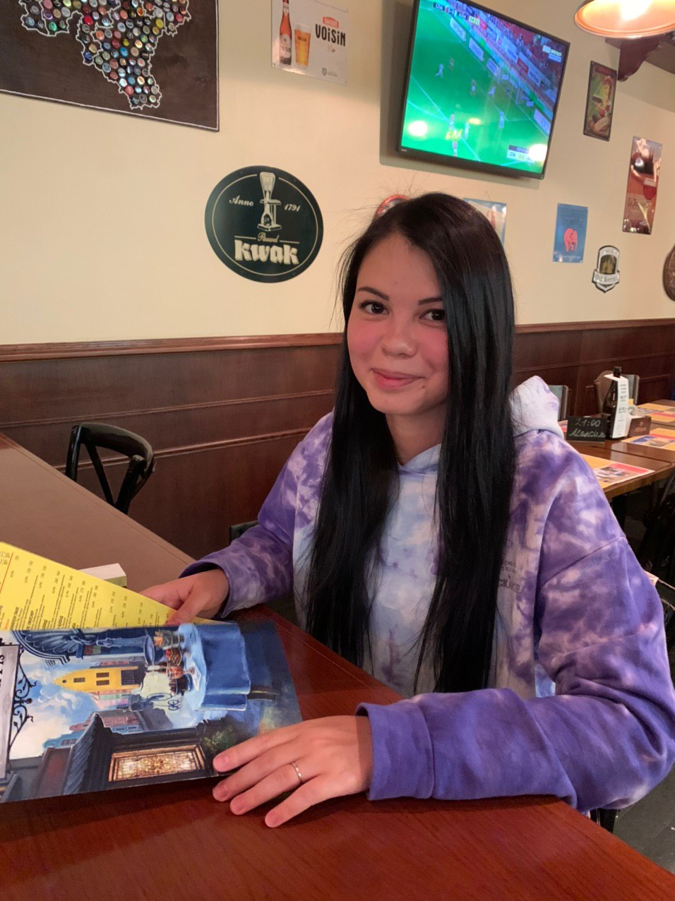

# Шварова Дина

> Мне нравится делать полезные продукты, помогать бизнесу, развивать людей и себя.

Про бизнес: люблю и умею выстроить рабочие процессы, обеспечить стабильность работы и помогаю бизнесу удостовериться, что всё работает так как надо. Забочусь о вверенных мне ресурсах, всегда готова оказать поддержку.

Про людей: вдохновляю на достижение поставленной цели, объединяю людей в команды, помогаю разрешить конфликты и повысить продуктивность.

Про мои сильные стороны: развитая эмпатия, креативность, гибкость в принятии решений. Люблю экспериментировать и находить нестандартные решения и подходы в работе.

Что еще про меня:
- Есть опыт публичных выступлений, общения с первыми лицами компании, адаптации новых сотрудников, сбора обратной связи от пользователей.
- Умею формировать и анализировать продуктовые гипотезы, user cases, требования к продукту, контролировать и нести ответственность за разработку продукта и его развитие.
- Знаю теорию и имею практический опыт проведения организационных изменений (аудит бизнес-процессов, формирование целей компании, внедрение методологий гибкой разработки, создание продуктовых команд)

### Мои навыки:
* UX/UI исследования, интервью, A/B тестирование
* Быстрая проверка гипотез
* Приоритизация на основе скоринга и WSJF
* Подбор персонала и создание продуктовых команд, работающих по Scrum, формирование культуры в команде
* Постановка стратегических целей и улучшение бизнес-процессов компании
* Организация эффективных коммуникаций
* Применение Data Driven подхода
* Расчет P&L и unit-экономики для продуктов
